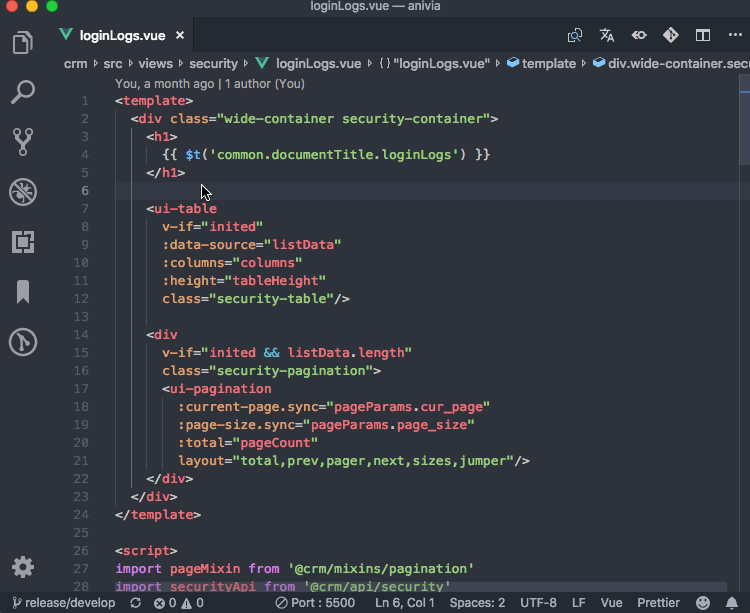
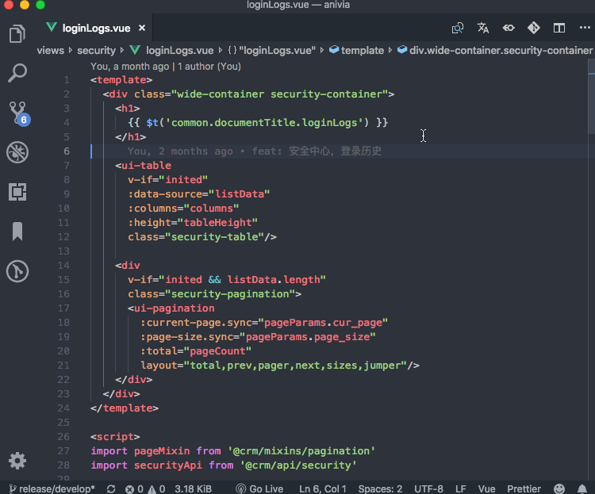
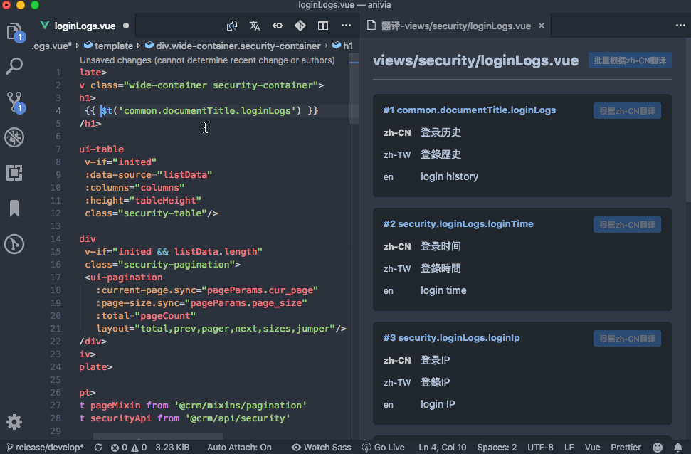
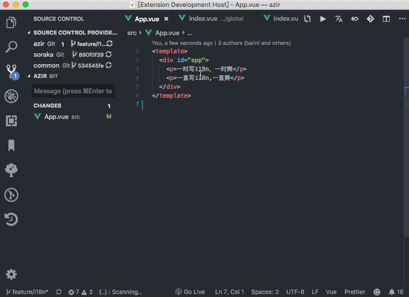

# vue-i18n

为什么要做这个插件？因为写 i18n 真的很啰嗦很麻烦啊 (╯‵□′)╯︵┻━┻

这个插件能够帮到你方便查看和编写 vue-i18n

> ✨ 目前是 alpha 版本

## 主要功能

### ♠ 方便查看对应的翻译

### ♠ 方便基于中文翻译其他语言

### ♠ 先写好 key，也能自动生成文件

### ♠ 也可以写好文案，再生成翻译 (选中后按下 command+.(OS X) 快捷键)

## 功能列表

- [x] 翻译提示
- [x] 以文件为维度管理
- [x] 自动翻译
- [x] 自动补全
- [x] 初始化配置 guide
- [x] 选择文案自动翻译
- [x] key 旁显示中文注释
- [ ] 快捷跳转到对应翻译文件
- [ ] 翻译率提示
