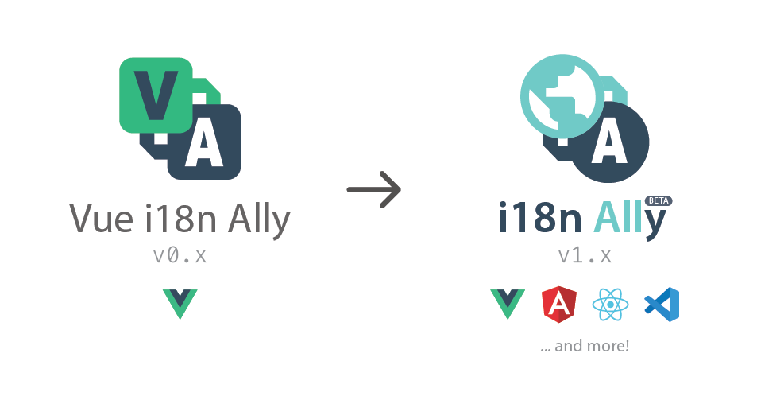

# *Vue i18n Ally* is now **i18n Ally**!

This extension is now come to v1.x stage! From v1.x, we make it not limited to support Vue but other frameworks such as React.js, Angular and more all in one extension!

## Migration from `Vue i18n Ally` (v0.x)

There is not to much works to be done for this migration.

1. Install the new `i18n Ally` from [the marketplace](https://marketplace.visualstudio.com/items?itemName=antfu.i18n-ally)
2. Uninstall the old `Vue i18n Ally`.
3. You are done. 🎉

Configurations are backward compatible. And all the features for Vue will work as it would do.

## New Features

- Support for Vue, React, Angular, i18next, VSCode extension and more. Check the <a href="https://github.com/antfu/i18n-ally#-supported-frameworks" target="__blank">Supported Frameworks List</a>
- Automatically detect what frameworks are using by reading `package.json`

## Breaking Changes

- Extension and Repo are renamed to `i18n-ally`
- Conguires namespace is renamed to `i18n-ally` with legacy `vue-i18n-ally` backward compatibility.
- Config `forceEnabled` is deprecated, use `enabledFrameworks` instead.
- Config `experimental.sfc` is deprecated. It will enabled automatically when you need it.

## Changes

- New Logo
- Updated documents
- `Vue i18n Ally` will disable itself when `i18n Ally` is installed.
- `i18n Ally` comes to master branch and `Vue i18n Ally` is moved to branch [`v0.x`](https://github.com/antfu/i18n-ally/tree/v0.x)
